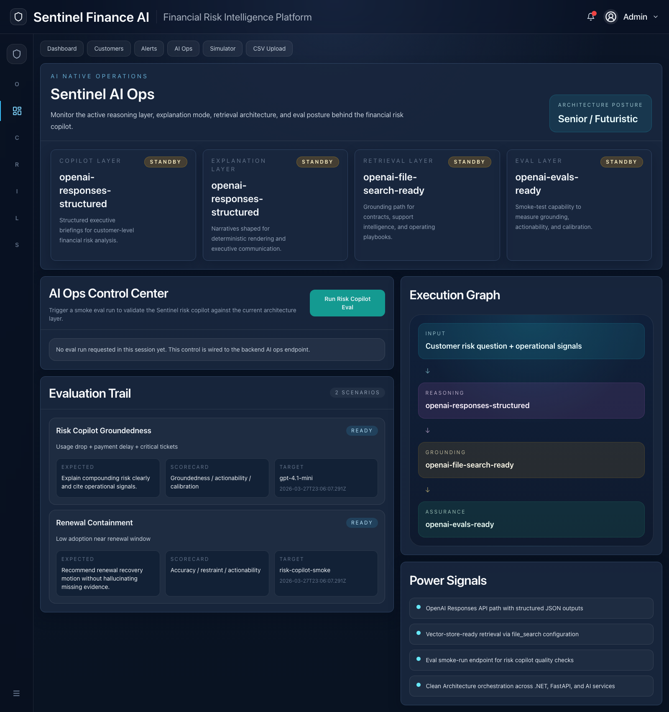

<p align="center">
  
</p>

# Sentinel Finance AI

<p align="center">
  
  
  
  
</p>

Enterprise-oriented financial risk intelligence showcase combining a Next.js interface, ASP.NET Core orchestration API, isolated FastAPI prediction service and AI-assisted explanations.

> Portfolio project. Predictive outputs and integrations are demonstrative unless explicitly backed by measured production data.

## What it demonstrates

- executive risk dashboard and customer portfolio workflows
- composite risk scoring and category breakdowns
- AI-assisted executive briefings
- prediction service isolation with FastAPI
- structured AI outputs designed for deterministic UI rendering
- retrieval-oriented grounding over business knowledge
- operational alerts and simulation flows
- clean separation between frontend, API, prediction and infrastructure concerns

## Product surface

### Dashboard


### Customers


### AI Operations


## Architecture

```text
Next.js frontend
      │
      ▼
ASP.NET Core 8 API
      │
      ├── PostgreSQL
      ├── Redis
      ├── OpenAI API
      │
      └── FastAPI prediction service
```

## AI layer

- OpenAI Responses API
- structured JSON outputs
- retrieval-oriented grounding
- evaluation-ready AI Ops surface
- isolated prediction logic for future model evolution

## Repository structure

```text
frontend/             Next.js application
backend/              ASP.NET Core API and tests
prediction-service/   FastAPI prediction service
docs/                 architecture, branding and screenshots
datasets/             demo data
docker-compose.yml    local orchestration
```

## Run locally

```bash
cp .env.example .env
docker compose up --build
```

Optional configuration:

```env
OPENAI_API_KEY=your_key_here
OPENAI_MODEL=gpt-4.1-mini
```

Without an API key, the demo uses deterministic local behavior where supported.

## Roadmap

- stronger vector retrieval and grounded citations
- measured AI evaluation runs
- Redis-backed caching and asynchronous recalculation
- stronger authentication and authorization
- multi-tenant architecture
- model registry and agentic investigation workflows

## Portfolio notes

See [`docs/portfolio/PROJECT_POSITIONING.md`](docs/portfolio/PROJECT_POSITIONING.md) for the intended scope and positioning of this repository.
