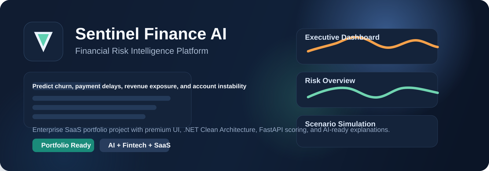
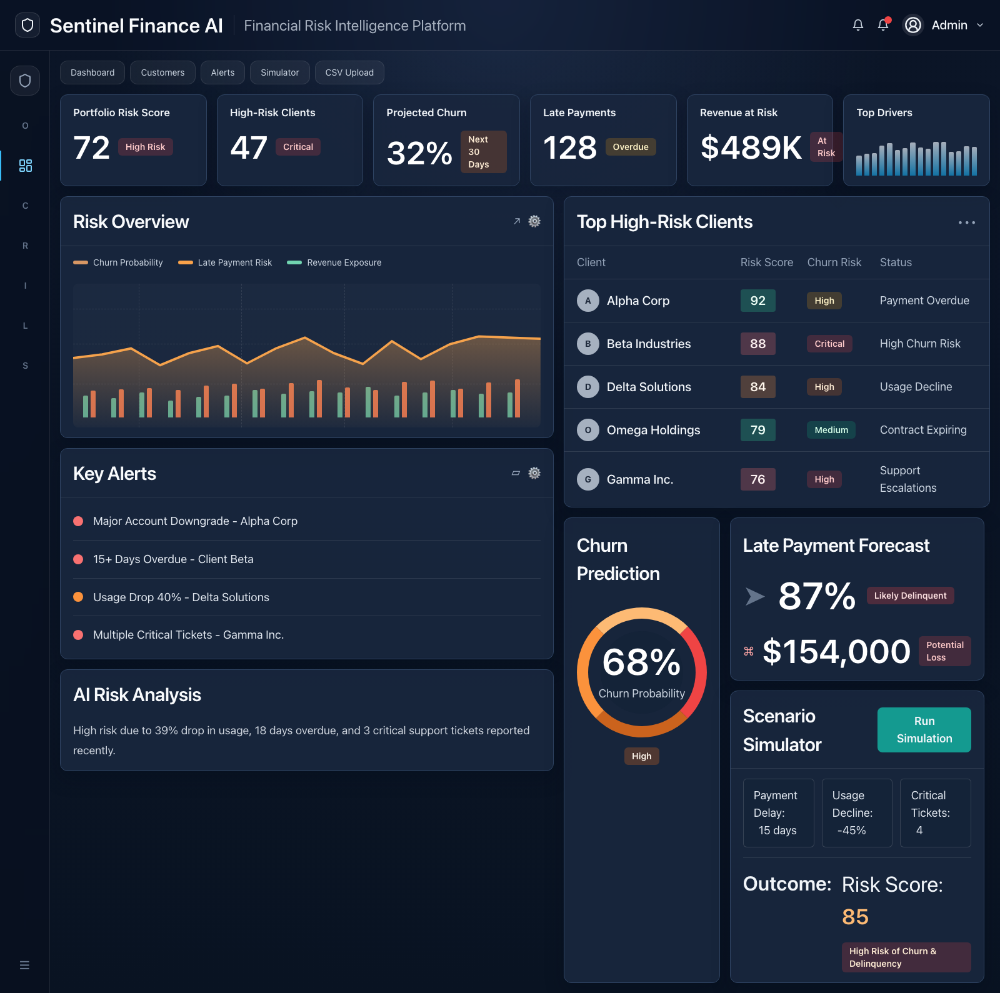
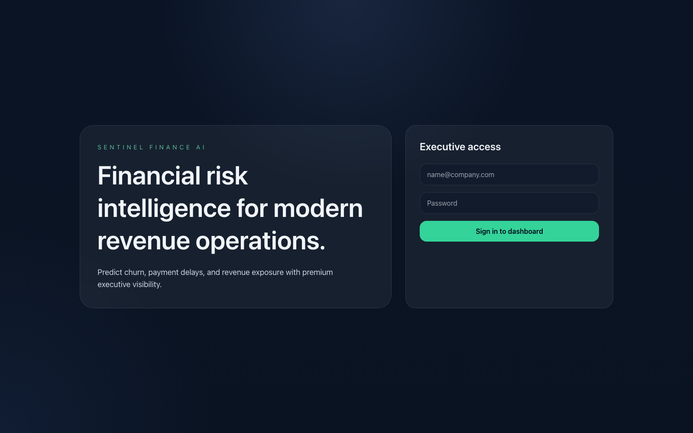
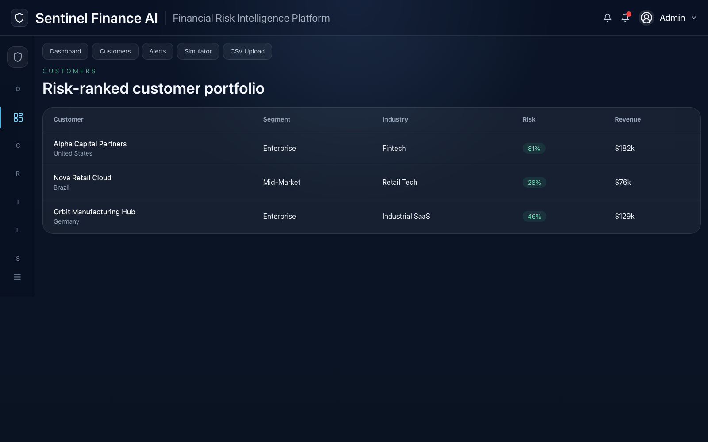

<p align="center">
  
</p>

# Sentinel Finance AI

<p align="center">
  
  
  
  
</p>

**Sentinel Finance AI is a next-generation financial risk intelligence platform built to predict churn, payment delays, revenue exposure, and operational risk using predictive analytics and AI-generated explanations.**

Sentinel Finance AI is designed as a senior-level portfolio project with enterprise SaaS positioning, clean architecture, premium UI direction, and clear expansion paths for future AI and analytics capabilities.

## Screenshots

### Dashboard



### Login



### Customers



## Product vision

Sentinel turns fragmented finance and customer-health signals into a single decision surface for revenue, risk, and operations leaders.

## MVP capabilities

- Executive dashboard with portfolio KPIs
- Customer portfolio list and customer detail view
- Composite risk scoring and category-level risk scores
- Churn and late payment prediction service
- Alert center for critical accounts
- Scenario simulator
- CSV ingestion entry point
- AI explanation endpoint for concise executive narratives

## Architecture

```text
frontend (Next.js)
    ->
backend API (ASP.NET Core 8, Clean Architecture)
    -> prediction-service (FastAPI)
    -> PostgreSQL
    -> Redis
    -> OpenAI API
```

## Technical decisions

- .NET API is the orchestration layer and single source of truth for frontend consumption.
- Prediction logic is isolated in FastAPI so scoring can evolve independently from the transactional API.
- Clean Architecture keeps domain rules separate from transport and infrastructure concerns.
- Demo seed services accelerate portfolio presentation while preserving a clear path to EF Core persistence.

## Structure

```text
sentinel-finance-ai/
  frontend/
  backend/
    src/
      Sentinel.Api/
      Sentinel.Application/
      Sentinel.Domain/
      Sentinel.Infrastructure/
    tests/
  prediction-service/
  docs/
  datasets/
  docker-compose.yml
  README.md
```

## Local run

```bash
cp .env.example .env
docker compose up --build
```

### Refresh README screenshots

Start the frontend locally and run:

```bash
cd frontend
npm run capture:readme
```

Additional UI flows for customers, alerts, simulator, and upload are scaffolded in `frontend/app/`.

## Roadmap

### V2

- EF Core persistence and ingestion pipelines
- Redis-backed caching
- richer auth and async recalculation jobs

### V3

- multi-tenant architecture
- MLflow and model registry
- agentic investigation workflows
- enterprise integrations
